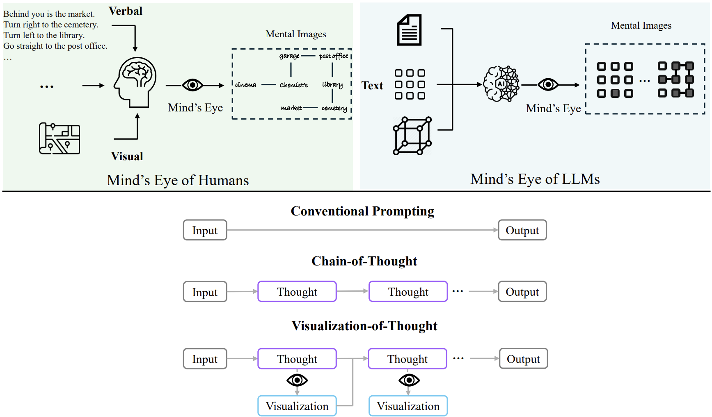
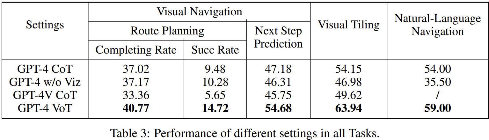

# Visualization-of-Thought Elicits Spatial Reasoning in Large Language Models



This is the repository implements code for the paper [Visualization-of-Thought Elicits Spatial Reasoning in Large Language Models](https://arxiv.org/pdf/2404.03622.pdf) and the model used in the paper are GPT-4-0125-Preview and GPT-4-Vision.

## Ideation

The paper propose a new prompting method which is called Visualization-of-Thought or VoT where LLM could visualize an imaginary visualization in their memory (Mind's Eye or Mental Images) and use that to help them solve problem that required visualize out each of the step in order to keep track and seeing the update of the changes.

The paper focused on compare the performance between VoT, CoT and No Visualization CoT for GPT-4 and GPT-4V

The result of the comparison can be seen at here where GPT-4 with VoT outperform CoT in both Vision and Non-Vision GPT-4 Version. This proven that VoT can really be used for task where image play a role as information and we can explain the image using natural language and ask the LLM to visualize it out in their thinking process.


## Setup

### 1. Local

```bash
git clone https://github.com/sitloboi2012/Visualization-Of-Thought.git
conda create --name vot-prompt python=3.11 -y
conda activate vot-prompt
set OPENAI_API_KEY=sk-123
pip install -r requirements.txt

----
cd prompts
python next_step_prediction.py #to run Next Step Prediction Task
python route_planning.py #to run the Route Planning Task
python natural_language_navigation.py #to run the Natural Language Task
```

### 2. Docker

```bash
TBA
```

## References

```bibtex
@misc{shao2024visual,
      title={Visualization-of-Thought Elicits Spatial Reasoning in Large Language Models}, 
      author={Wenshan Wu, Shaoguang Mao, Yadong Zhang, Yan Xia, Li Dong, Lei Cui, Furu Wei},
      year={2024},
      eprint={2404.03622},
      archivePrefix={arXiv},
      primaryClass={cs.CL}
}
```
